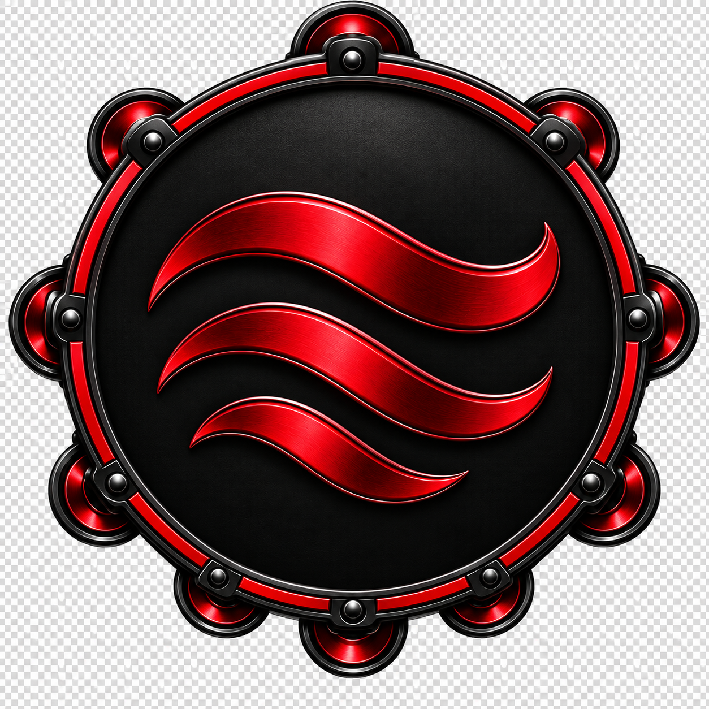
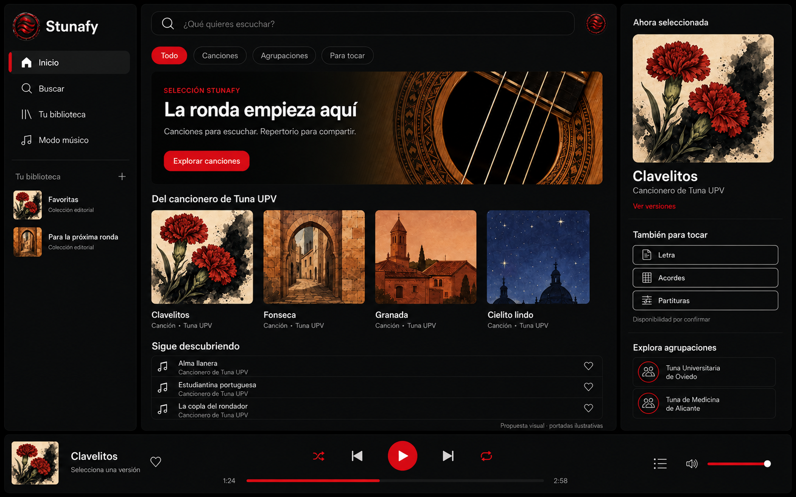
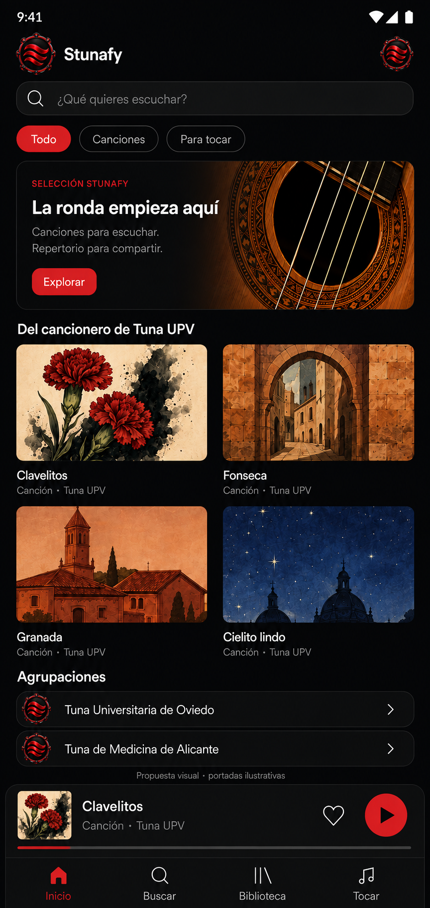
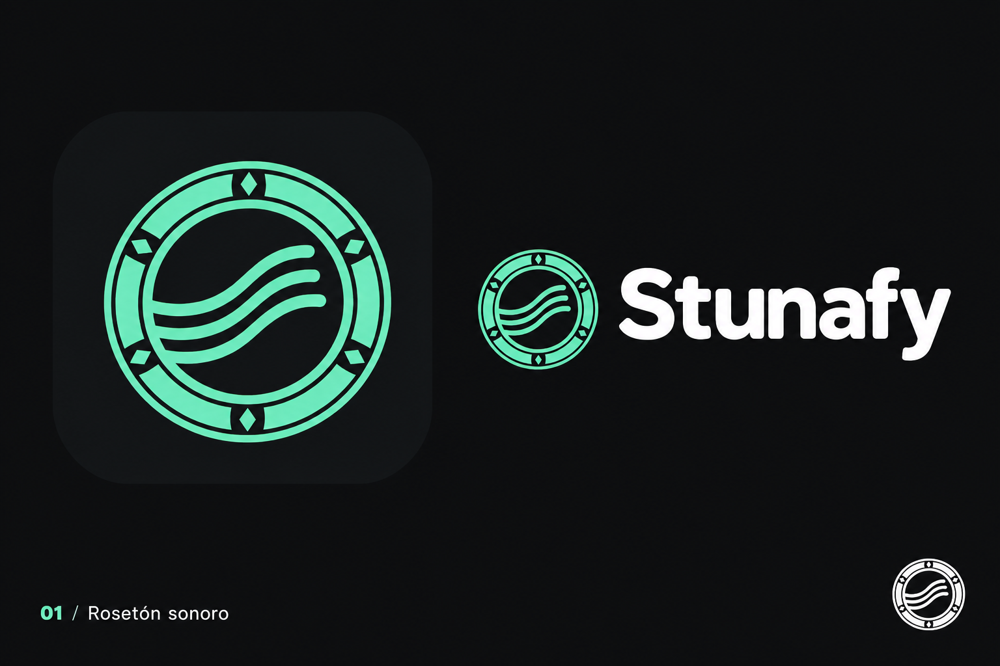
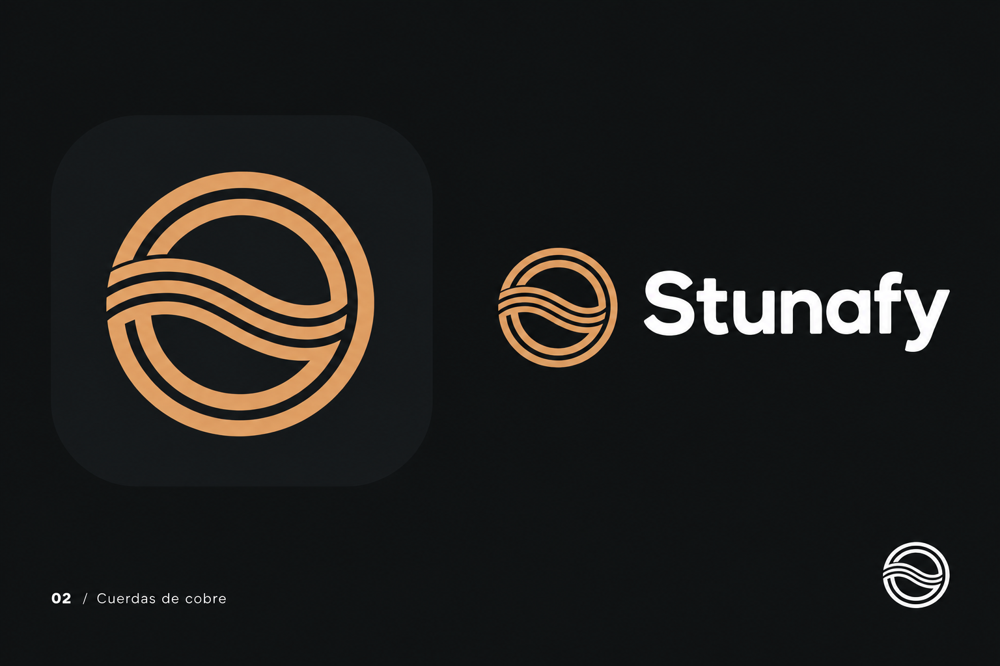
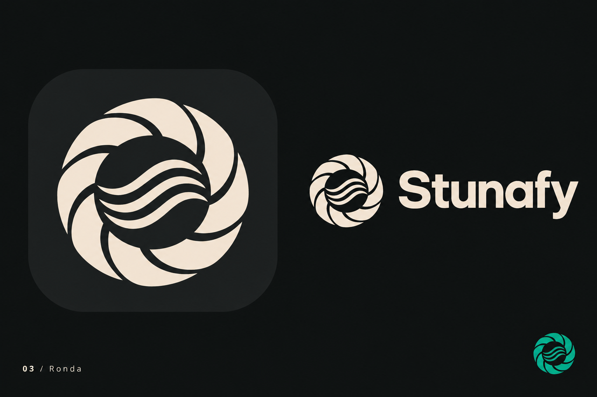

# Stunafy · diseño visual v1

5 de septiembre de 2026 · revisión con logo elegido.

Nombre confirmado: **Stunafy**. El promotor ha elegido como logo provisional la pandereta española negra con ondas rojas de la referencia compartida. Las tres propuestas anteriores se conservan como exploración; dejan de ser la identidad aplicada a las pantallas.

## Logo elegido

La imagen procede del recurso compartido [“Pandereta española con ondas rojas”](https://chatgpt.com/s/m_6a9c42a5279c81918cc0358e41eec2db) y se guarda como referencia raster en `logo-elegido-pandereta-roja.png`. Se usará en las maquetas de esta revisión. Antes de desarrollar se deberán preparar una versión vectorial, variantes para fondos claros y oscuros, tamaños mínimos y exportaciones para Android y web.

## Pantalla de escritorio

Biblioteca lateral, búsqueda superior, selección de canciones, panel de material musical y reproductor persistente. La interfaz se inspira en la organización de Spotify, con el rosetón, la paleta y las ilustraciones de Stunafy.

## Adaptación móvil

Tarjetas en dos columnas, búsqueda visible, mini reproductor y navegación inferior. El panel derecho de escritorio se resolverá en la futura ficha de canción; la captura móvil muestra la pantalla principal. Las proporciones de las imágenes son de presentación y deberán ajustarse en el diseño implementable a las pantallas objetivo.

## Tres propuestas de logo

### 01 · Rosetón sonoro

Ondas dentro de un anillo con detalles de rosetón. Es la opción usada en las maquetas por su relación visible con el instrumento y la señal musical.

### 02 · Cuerdas de cobre

Anillos y cuerdas con menos detalle ornamental; alternativa cálida que habrá que comparar a tamaño de icono real.

### 03 · Ronda

Segmentos curvos alrededor de las ondas, con una presencia más abstracta. El tablero incluye una variante jade.

Cada tablero muestra icono de aplicación y combinación con el nombre. Son exploraciones raster; el logo elegido necesitará construcción vectorial, tamaños mínimos y exportaciones finales, todavía no realizados.

## Base visual propuesta

| Elemento | Criterio |
|---|---|
| Fondo | #101413 |
| Superficies | #171B19; niveles diferenciados para biblioteca y reproductor |
| Acción principal | Rojo del logo, referencia aproximada #E3262E, texto blanco o negro según contraste |
| Texto | Blanco cálido; secundario gris verdoso |
| Alternativas de marca | Jade, cobre y marfil quedan como exploración, no como identidad aplicada |
| Tipografía | Sans serif contemporánea, títulos de peso alto; familia final pendiente de elegir y licenciar |
| Navegación | Inicio, búsqueda, biblioteca y modo músico; adaptación inferior en móvil |
| Tarjetas | Imagen editorial y título; fuente visible, sin intérprete inventado |
| Estados | Canción seleccionada, reproducción sin iniciar y material cuya disponibilidad está por confirmar |

Los códigos son referencias de implementación futuras: una imagen generada puede presentar ligeras variaciones. Se comprobarán contraste, foco, tamaños táctiles y reflujo al producir componentes reales.

## Contenido comprobado e ilustrativo

Se han usado siete títulos reales del [cancionero de Tuna UPV](https://tuna.upv.es/cancionero). Las dos agrupaciones están registradas en su [índice de CDs](https://tuna.upv.es/cds). Las portadas son ilustraciones generadas para esta propuesta y no corresponden a álbumes oficiales.

La [ficha de contenido y fuentes](contenido-y-fuentes.md) explica qué se verificó y qué es ilustrativo. Las maquetas son imágenes estáticas: no reproducen audio ni acreditan derechos de los materiales.

## Archivos y método

Todos los PNG entregados están guardados en esta carpeta. Se utilizó **ImageGen integrado**, con una revisión de los logos para quitar brillos. El [conjunto de prompts](prompts.md) conserva las instrucciones utilizadas y las referencias entre imágenes.

Revisión visual realizada: nombre Stunafy, títulos de las canciones, presencia del logo elegido, acentos rojos, textos de procedencia y ausencia de solapamientos evidentes. La maqueta ya tiene una primera implementación web navegable; la interacción nativa y el APK quedan pendientes.

Siguiente decisión de diseño: validar las proporciones del logo y la paleta en tamaños reales. Después se podrá detallar la ficha de canción y el reproductor ampliado.
