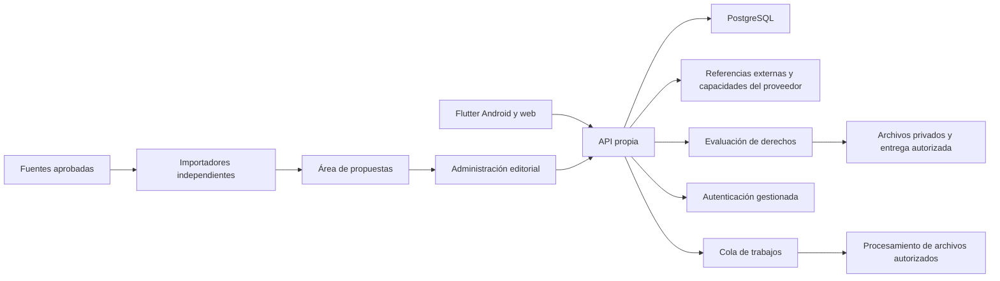

# Arquitectura propuesta

El [hilo de referencia](https://chatgpt.com/share/6a9c3582-0188-83eb-856c-772781f3a065) orienta el orden de diseño: modelo maestro antes de elegir servicios y desarrollar pantallas. Se mantiene la propuesta técnica inicial como candidata; el hilo no selecciona PostgreSQL, Supabase ni FastAPI.

## Catálogo y acceso al contenido

Una ficha reúne información musical independiente del lugar donde se encuentra. El módulo de catálogo conserva identidades y relaciones; el de acceso decide cómo puede utilizarse cada recurso:

| Vía | Comportamiento |
|---|---|
| Referencia externa | Identificador/URL y metadatos permitidos; apertura en el origen, sin copiar el archivo |
| Integración oficial | Adaptador del proveedor con capacidades, atribución, caducidad y restricciones propias; pendiente de validar |
| Alojamiento autorizado | Archivo recibido por canal permitido, almacenamiento privado y entrega según permisos |

El adaptador declara si permite reproducción interna, vídeo visible, segundo plano, offline, control de tempo o solo apertura externa. La interfaz usa esas capacidades sin prometer una cola universal entre plataformas. Un mismo recurso lógico puede tener varias ofertas de acceso; cada oferta conserva su proveedor, disponibilidad y condiciones.

La API prepara una vista agregada de canción con materiales alternativos y correspondencias verificadas. No realiza consultas en vivo a todas las fuentes cada vez que se abre una ficha. Las referencias de proveedores se renuevan conforme a sus políticas y no se convierten automáticamente en metadatos permanentes del catálogo independiente.

## Componentes y responsabilidades

La API es la autoridad de catálogo, permisos, biblioteca y edición. Los clientes no escriben directamente en las tablas del catálogo ni contienen credenciales de importadores. El audio se entrega desde almacenamiento/CDN autorizado, evitando transportar todos sus bytes por la API.

## Elecciones y alternativas

| Capa | Propuesta | Motivo y alternativa |
|---|---|---|
| Aplicaciones | Flutter, diseño adaptable | Comparte lógica y UI; validar audio, PDF, accesibilidad y navegador antes de comprometer alcance |
| API | Monolito modular; candidato Python con FastAPI | Un despliegue inicial, contratos claros y afinidad con importadores; NestJS es alternativa si el equipo domina TypeScript |
| Catálogo | PostgreSQL | Relaciones, restricciones, transacciones y consultas cruzadas; esquema principal estable |
| Servicios gestionados | Supabase como candidato | PostgreSQL, Auth y Storage; comparar región, coste y recuperación antes de contratar |
| Identidad alternativa | Firebase Auth con PostgreSQL | Válido si existe preferencia o infraestructura Firebase; no obliga a usar Firestore para el catálogo |
| Búsqueda | Índices de PostgreSQL y normalización | Añadir un motor dedicado únicamente si las mediciones lo justifican |
| Archivos | Almacenamiento de objetos privado cuando proceda | Metadatos y referencias en base de datos; alojar solo los originales/derivados autorizados |
| Importación | Procesos independientes del servidor público | Una fuente lenta o averiada no bloquea la app |

Firestore utiliza documentos y colecciones. Supabase ofrece PostgreSQL completo. La preferencia relacional es una decisión de diseño para las relaciones entre obras, recursos, evidencias y versiones; ambas familias pueden escalar. Fuentes: [modelo Firestore](https://firebase.google.com/docs/firestore/data-model), [PostgreSQL en Supabase](https://supabase.com/docs/guides/database/overview).

Flutter web se orienta a experiencias de aplicación. Si se necesita posicionar en buscadores fichas públicas con mucho texto, se evaluará una web pública renderizada en servidor que consuma la misma API. No se promete resolver SEO con Flutter. Fuente: [FAQ oficial de Flutter web](https://docs.flutter.dev/platform-integration/web/faq).

## Organización lógica

Módulos: identidad y acceso; catálogo; recursos, ofertas de acceso y derechos; reproducción; biblioteca; agrupaciones; importación y revisión; búsqueda; auditoría. Cada módulo controla sus escrituras y ofrece contratos al resto. Los importadores no duplican las reglas de publicación de la API.

En Flutter: presentación por funcionalidad, casos de uso, entidades de dominio y adaptadores de API, almacenamiento local y reproducción. El reproductor mantiene una sesión única independiente de la pantalla abierta. Los componentes compartidos incluyen accesibilidad, estados vacíos y errores.

## Contrato de API, todavía sin implementación

| Operación | Contrato conceptual |
|---|---|
| Buscar | GET /v1/search, consulta y filtros; cursor y resultados agrupados por tipo |
| Consultar obra | GET /v1/works/{id}, arreglos y grabaciones publicadas |
| Consultar arreglo | GET /v1/arrangements/{id}, revisiones y materiales compatibles |
| Solicitar reproducción | POST /v1/playback-sessions, recurso y contexto; entrega temporal si procede |
| Consultar recursos | GET /v1/resources/{id}, procedencia pública y acciones permitidas |
| Biblioteca | /v1/me/favorites, /playlists, /history y /setlists con autorización por propietario |
| Importación y revisión | /v1/admin/imports y /reviews, reservado a roles administrativos |

IDs estables; paginación por cursor; fechas UTC; formatos versionados; errores con código, explicación y request_id. Actualizaciones con revisión esperada para detectar conflictos; creaciones reintentables con clave de idempotencia. La API devuelve capacidades y motivos de indisponibilidad, pero vuelve a validar los permisos al servir cada recurso.

## Reproducción y offline

Audio propio o licenciado: validar formato, generar derivados solo cuando el permiso lo cubra y emitir acceso temporal con alcance concreto. El enlace temporal limita acceso; no sustituye una licencia ni garantiza que un usuario no copie el audio.

Android necesita integración de sesión multimedia, controles del sistema, foco de audio y servicio de reproducción conforme a las reglas vigentes. En web se validan inicio por gesto del usuario, pestañas suspendidas y diferencias de navegador. No se promete igualdad de reproducción en segundo plano entre Android y web.

Offline futuro: manifiesto por usuario/dispositivo con revisión, hash, recursos, permiso y vencimiento. Revalidación al reconectar y límite local de vigencia. Una retirada remota no puede borrar inmediatamente un dispositivo desconectado; los acuerdos deben contemplar esa limitación. El almacenamiento del navegador puede ser eliminado por el propio navegador y no equivale a una descarga persistente garantizada.

Favoritos se sincronizan mediante operaciones identificadas; borrados conservan marcas de eliminación durante el periodo acordado. Playlists y repertorios usan revisiones; un conflicto de ordenación se muestra para resolverlo. No se sobrescribe silenciosamente un repertorio preparado en otro dispositivo.

## Seguridad y operación

Validación de tokens y permisos en servidor; MFA para administración; secretos fuera del cliente; límites de solicitudes; análisis de archivos; registros sin tokens ni URLs firmadas. Aislamiento de datos privados de usuarios y agrupaciones. Las protecciones de base de datos complementan la autorización de API.

Entornos separados de desarrollo, pruebas y producción. Migraciones versionadas, backups de base de datos y estrategia independiente para archivos, con restauraciones verificadas. Una copia de la base no garantiza recuperar los binarios.

La publicación genera eventos durables para índices, invalidaciones y procesos mediante una bandeja transaccional. Trabajos reintentables e idempotentes. Métricas: latencia, errores, inicio de audio, fallos de importadores, recursos caducados y cola editorial. No registrar escuchas personales como métricas públicas.

Escalar primero API y trabajadores por separado, después índices y entrega de archivos según carga. Evitar microservicios iniciales sin necesidad operativa demostrada.

El presupuesto se calculará con usuarios activos, minutos de audio, bitrate, almacenamiento, transferencia, copias y horas editoriales. No se fija precio sin tráfico y presupuesto conocidos. La transferencia y los derechos musicales pueden dominar el coste.
