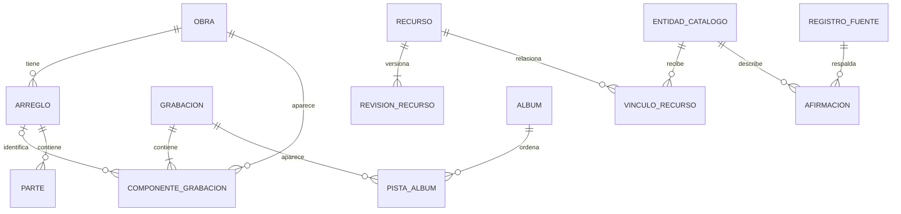

# Modelo de datos y versiones

Modelo lógico propuesto. Todavía no es un esquema SQL ni una migración.

## Ficha maestra de canción

La estructura «canción → letras, acordes, partituras y versiones» del [hilo compartido](https://chatgpt.com/share/6a9c3582-0188-83eb-856c-772781f3a065) se conserva como vista para el usuario. Internamente se separan entidades para evitar que una letra, un tono o una partitura se atribuyan a todas las interpretaciones.

La ficha puede reunir varios documentos de letra/acordes con sus fuentes, arreglos con partes numeradas, grabaciones y álbumes, material didáctico y contexto histórico. Un material puede vincularse a la obra con arreglo desconocido; no hay que inventar uno para catalogarlo. Una letra alternativa es otro documento, mientras que una corrección del mismo documento es una revisión.

## Qué significa «versión»

La interfaz podrá decir «Versiones», pero debe distinguir:

- **Obra:** composición identificable, con títulos alternativos y créditos.
- **Arreglo:** adaptación musical concreta, con instrumentación, estructura y responsable cuando se conozca.
- **Grabación:** interpretación fijada en audio o vídeo, con intérpretes, fecha y características propias.
- **Revisión editorial:** corrección de datos o material de una entidad; no crea por sí sola una nueva interpretación.

Dos agrupaciones pueden grabar el mismo arreglo. Una agrupación puede grabarlo varias veces. Un mismo máster puede aparecer en varios álbumes. Una remasterización puede necesitar un recurso o edición vinculada a la grabación, sin inventar una interpretación nueva.

## Entidades principales

| Entidad | Campos y relaciones relevantes |
|---|---|
| CatalogEntity | UUID, tipo, estado editorial, revisión, fechas; identidad común para procedencia y relaciones |
| Work | Título preferido, idioma, tipo; créditos N:M a personas/entidades; identificadores externos opcionales |
| WorkTitle | Obra, título, idioma, clase de alias, normalización y evidencia |
| WorkRelation | Dos obras y relación: adaptación, traducción, parte de otra; no fusionar por relación |
| Classification / EntityClassification | Género, ritmo y categoría con términos originales y equivalencias revisadas; asignación a obra, arreglo o grabación según corresponda |
| Place / CulturalAssociation | País/región y relación explícita: origen documentado, tradición o implantación de agrupación; varias asociaciones con evidencia |
| HistoricalNote / MusicalEvent | Nota editorial original con fuentes; composición, publicación o grabación con fecha y precisión separadas |
| Arrangement | Obra principal, nombre, créditos, instrumentación, tonalidad de referencia y notas |
| ArrangementComponent | Arreglo, obra, posición y sección; permite popurrís y arreglos de varias obras |
| ArrangementRevision | Arreglo, número, descripción y fecha; material puede apuntar a una revisión concreta |
| Recording | Título, duración, fecha y precisión de fecha, lugar opcional, tipo audio/vídeo/directo, créditos N:M |
| RecordingComponent | Grabación, obra, arreglo opcional, revisión opcional, orden e intervalos temporales opcionales |
| Group / Person / Credit | Agrupaciones y personas diferenciadas; crédito con rol, alcance y fuente |
| Album / AlbumTrack | Edición de álbum, intérpretes, fecha, disco, posición y grabación; portada como recurso con derechos |
| Instrument / Part | Instrumento extensible, afinación, registro; parte vinculada a arreglo/revisión con nombre y número |
| Resource / ResourceRevision | Tipo, idioma, formato, hash, tamaño, origen, archivo privado o referencia externa, versión anterior |
| AccessOffer | Revisión de recurso, proveedor/fuente, ID remoto, URL, vía de acceso, última comprobación, vigencia y capacidades; derechos específicos |
| LearningMaterial | Recurso didáctico, instrumento/voz objetivo, nivel si está justificado y relación con obra, arreglo o parte |
| SymbolicTrack | Revisión MIDI/MusicXML, pista/voz, instrumento declarado y parte asociada si se verifica; preparación para práctica futura |
| ResourceBinding | Recurso, entidad, función y compatibilidad: confirmada, sugerida o desconocida; procedencia del vínculo |
| LyricsDocument | Revisión de recurso, secciones y líneas estables; idioma y autoría; variantes separadas |
| ChordDocument | Revisión, secciones y eventos de acorde; puede referenciar líneas de una letra compatible |
| ChordEvent | Raíz, alteración, calidad, extensiones, bajo, posición y símbolo original; tokens sin interpretar se conservan |
| TimingMap | Grabación exacta, revisión de letra/partitura, marcas y calidad de sincronización; no reutilizable sin revisión |

CatalogEntity actúa como registro común; cada subtipo debe tener exactamente una entidad del tipo adecuado. Las relaciones que admitan varios tipos tendrán claves foráneas y validación de tipos; no se dejarán referencias de texto sin integridad.

ResourceBinding permite vincular un PDF a varias partes sin duplicar el archivo, indicando páginas. Un vínculo de compatibilidad sugerida no se muestra como «partitura de esta grabación».

ResourceRevision puede existir sin binario alojado: hash y tamaño son opcionales para referencias externas. AccessOffer distingue publicación en una plataforma de identidad de grabación; dos enlaces no son dos grabaciones por defecto. Las URL firmadas temporales no se usan como identificador estable.

Los formatos son extensibles: PDF, imágenes, MIDI, MuseScore, MusicXML, Encore, Guitar Pro y TuxGuitar pueden registrarse cuando estén identificados. Catalogar un formato no promete abrirlo, convertirlo o editarlo. La correspondencia entre pistas MIDI y partes musicales se valida; un MIDI no separa necesariamente los instrumentos como requiere el usuario.

El tono se almacena en arreglo, documento o grabación, con procedencia y grado de certeza. No habrá un único tono obligatorio de la obra. La interfaz distingue la tonalidad del arreglo, la del audio y la elegida para practicar. Género y año también requieren indicar a qué entidad y acontecimiento describen.

## Datos del usuario y administración

| Entidad | Uso |
|---|---|
| UserProfile / GroupMembership | Preferencias y pertenencias verificadas, separadas de la identidad del proveedor Auth |
| Favorite | Usuario, entidad y fecha; unicidad por usuario y entidad |
| Playlist / PlaylistItem | Propietario, visibilidad, revisión; elemento con grabación y posición estable |
| ListeningEvent | Usuario, grabación, instante y posición, con política de retención y consentimiento/base aplicable |
| Setlist / SetlistItem | Propietario, actuación opcional, orden, obra, arreglo/revisión, tono deseado, cejilla y notas |
| PracticePreference | Usuario, arreglo, instrumento, tono visual, tamaño y velocidad de autoscroll |
| Source / SourcePolicy | Fuente, identidad, URLs, método aprobado, límites, usos y fecha de próxima revisión |
| SourceRecord / ImportRun | ID remoto, URL, fecha consultada, huella, versión de parser y ejecución |
| Assertion / CanonicalSelection | Entidad, campo, valor candidato, fuente, confianza, decisión y editor; selección del dato vigente |
| RightsGrant / RightsRequirement | Evidencia y alcance del permiso; capas necesarias para una acción sobre un recurso |
| ResourceGrant | Vincula revisión de recurso y permisos aplicables; varios permisos pueden ser necesarios conjuntamente |
| RightsDecision | Recurso/revisión y oferta de acceso aplicable, acción, territorio, periodo, decisión, evidencias y responsable |
| Review / MergeEvent / AuditEvent | Revisión editorial, fusiones reversibles y cambios con autor, fecha y motivo |

## Invariantes

1. Un título no es una clave única de obra. Se conservan acentos y grafía original; el texto normalizado solo ayuda a buscar.
2. La clave (fuente, ID remoto) identifica el registro de origen. Su URL puede cambiar sin cambiar la entidad canónica.
3. La huella de archivo idéntica detecta bytes repetidos; no demuestra autoría, licencia ni igualdad entre obras.
4. Un dato desconocido permanece nulo o marcado como desconocido. «Popular» no se añade como autor por falta de información.
5. No se publica una afirmación sin fuente o justificación editorial. Dos fuentes que discrepan conservan ambas afirmaciones.
6. Un permiso de audio no habilita la letra, la partitura ni la portada. Cada revisión de recurso tiene evaluación propia o alcance explícito de un permiso existente.
7. Las fusiones conservan IDs anteriores mediante redirección, migran referencias de forma auditada y permiten deshacer la operación.
8. Los créditos distinguen compositor, letrista, arreglista, intérprete, editor, transcriptor y productor cuando se conozcan.

## Ejemplo ficticio de validación

«Ronda de septiembre» es una obra inventada para este ejemplo. Tiene un arreglo para bandurria, laúd y guitarra y otro para coro con guitarra. Dos agrupaciones ficticias graban el primer arreglo; una segunda toma de la misma agrupación constituye otra grabación.

El PDF de bandurria pertenece al primer arreglo, revisión 1. No aparece como parte del segundo. Un MP3 y un archivo de mayor calidad pueden representar la misma grabación mediante recursos distintos. Una corrección tipográfica del PDF crea una revisión del recurso. Una nueva instrumentación requiere evaluar un nuevo arreglo.

Caso adicional: un popurrí contiene dos obras mediante componentes ordenados. Una letra traducida conserva relación con la obra de origen, con autoría y derechos de traducción evaluados. Ninguno de estos casos se resuelve duplicando títulos sin relaciones.
